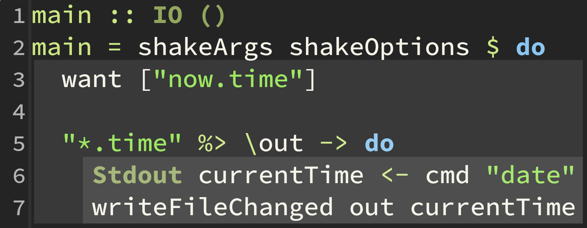

# Introduction
\section{Introduction}
# Motivation

Common situation:

- lots of files
- target: create a result (compiled code, image, ...)
- complex relationship between files

- this talk: use `Shake` to automate work

# Make

> Besides building programs, Make can be used to manage any project
> where some files must be **updated automatically** from others
> whenever the others change.

- often used to build C(++) programs/libraries
- other build systems: cabal, stack, sbt, maven, gradle
- most are focused on building *programs*

# Maintaining A Make Build

{width=75%}

# We Wrote Our Own

{width=80%}

# [Shake](http://shakebuild.com/)

> Shake is a **library** for writing build systems.

- written in Haskell (of course)
- no assumptions about build result
- you can build anything!

# Shake vs Make

- what's the deal about `shake`?
- shake is `monadic`
- make is only `applicative`
- (let's forget about the unprincipled rest for now)
- and `Monad` is far more powerful than `Applicative`

# Dressing Up

{width=90%}

# Dressing Up

{height=60%}

# Dressing Up

- rebuild only files that need to be built

```
> ./Build.hs clean && ./Build.hs
> rm coat && ./Build.hs
> rm 'right sock' && ./Build.hs
```

# Using Shake
\section{Using Shake}

# Using Shake
{height=60%}

# It's a Library

- `Shake` is meant to be used as a library
- use Haskell to describe your rules
- use rules to build your output

\footnotesize
```haskell
main :: IO ()
main = shakeArgs shakeOptions $ do
  want ["now.time"]

  "*.time" %> \out -> do
    Stdout currentTime <- cmd "date"
    writeFileChanged out currentTime
```
\normalsize

# It's a Library

Awesome because:

- `Turtle` for shell scripts in Haskell
- `Dhall` to handle configs
- `Wreq` for arbitrary http calls
- `Pandoc` for conversions of documents
- `lens`, `pipes`, `conduit`, `async`, ...

# Rules

you define rules inside the `Rules` (monad)

\footnotesize
```haskell
(%>) :: FilePattern -> (FilePath -> Action ()) -> Rules ()
-- usage:
"filepattern" %> \outPath -> doSomethingWith outPath
```
\normalsize

rules specify an `Action` to build the `outPath`

# And Action

The file building *action* is where you have to do your work

\footnotesize
```haskell
generateTime :: FilePath -> Action ByteString
generateTime outPath = do
  putNormal "Asking the gods for the current time"
  Stdout stdout <- cmd "date"
  return stdout

dateRule :: Rules ()
dateRule = "*.time*" %> generateTime
```
\normalsize

# And Action

- `Action` has a `MonadIO` instance -> `liftIO`
- use predefined functions in `Shake`
  - running external commands
  - perform tracked IO operations
  - depend on inputs

# Writing Rules

\footnotesize
```haskell
-- glob patterns
"pattern" %> action

-- multiple glob (OR)
["pattern1", "pattern2"] %> action

-- arbitrary predicates
isPrefixOf "some-prefix" ?> action

-- build multiple files (AND)
["*.o", "*.hi"] &%> action
```
\normalsize

# Writing Actions

\footnotesize
```haskell
"pattern" %> \outPath -> do
  need ["some-input.txt"]
  somethingSomething outPath
```
\normalsize

# Writing Actions

Use `need` to depend on input files

\footnotesize
```haskell
need :: [FilePath] -> Action ()

need ["file1", "file2"]

need ["file1"]
need ["file2"]
```
\normalsize

- all arguments in the list are built in parallel

# Running External Commands

External commands can be run via `cmd`:

\footnotesize

```haskell
cmd "git commit -m test"
cmd "git" ["commit", "-m", "test"]
cmd "git" ["commit", "-m", "this is a test"]
```

\normalsize

# Running External Commands

also supports special arguments:

\footnotesize

```
Cwd <path>
AddEnv "NAME" "VALUE"
Shell
Timeout 4.2
WithStdout True
EchoStdout True
FileStdout <file>
```

\normalsize

and more, see `CmdOption` on hackage

# Running External Commands

Example: `unzip` a file

\footnotesize

```haskell
cmd [Cwd "/tmp/test/", EchoStderr True] "unzip" ["-o", "test.zip"]
```

\normalsize

# Running External Commands

Another: run `latexmk`

\footnotesize

```haskell
cmd [Cwd cwd
    ,WithStdout True
    ,EchoStdout False
    ,EchoStderr False
    ,Stdin ""
    ] bin ["-g", "-shell-escape", "-pdf", inp]
```

\normalsize

# Running External Commands

The *output* is also flexible:

```haskell
examples = do
  Stdout stdout <- cmd "date"
  (Exit code, Stderr stderr) <- cmd "date"
  CmdTime t <- cmd "sleep 1"
  Process handle <- cmd "wget haskell.org"
  return ()
```

See [CmdResult](https://hackage.haskell.org/package/shake-0.16/docs/Development-Shake.html#t:CmdResult)

# Working With Files

Shake provides many helpful functions:

\footnotesize

```haskell
copyFile' old new
copyFileChanged old new

readFile' file
writeFileChanged file content

removeFiles dir [pattern1, pattern2]
removeFilesAfter

withTempFile
withTempDir

-- ... many more
```

\normalsize

# Working With Files

- when possible always prefer `Shake` versions
- automatic tracking of input
- `-Changed` functions are handy to avoid unnecessary rebuilds

# Reports

- shake can produce reports in html and other formats
- the html version is interactively explorable
- let's look at a report!

# Even Deeper
\section{Even Deeper}

# Even Deeper

{width=80%}

# Even Deeper

- up to this point: how to use `shake` for most things
- recall: it's a library
- extension points to customize it to your needs

# Track arbitrary IO actions

- recall: `Action` has a `MonadIO` instance
- we can therefore use arbitrary `IO` actions
- instead of `liftIO` you shoudl use `traced`:

\footnotesize
```haskell
traced :: String -> IO a -> Action a

download :: String -> FilePath -> Action ()
download uri outPath = traced "named" $ do
  r <- Wreq.get uri
  BL.writeFile target (r ^. Wreq.responseBody)
```
\normalsize

# Non-file dependencies

Shake also supports tracking of other things

\footnotesize
```haskell
example :: Action ()
example = do
  home <- getEnv "HOME"
  contents <- getDirectoryContents "."
  doSomething home contents
```
\normalsize

Even more powerful: we can define our own using "Oracle rules"

# Oracle rules

\footnotesize
```haskell
newtype GitHash = GitHash ()
  deriving (Show,Typeable,Eq,Hashable,Binary,NFData)

shakeArgs shakeOptions $ do
  addOracle $ \(GitHash ()) ->
    fromStdout <$> cmd "git" ["rev-parse", "--short", "HEAD"]

  "some-file" %> \out -> do
    hash <- askOracle (GitHash ())
    doSomething hash
```
\normalsize

# Oracle rules

- with oracles, you can depend on anything you want
- gotcha: will *always* be run in a build if required
  - though they only invalidate others if sth. changed
  
# Using Resources

- mosts tasks won't be cpu-bound
- and resources are not infinite
- if we `need` a list of 1000 images..
- some form of limit would be good
- shake: resources and throttles

# Using Resources

- finite resources with limited number of slots: `newResource`
- throttle how many actions are run in time period: `newThrottle`

\footnotesize
```haskell
main :: IO ()
main = shakeArgs shakeOptions $ do
  -- max 10 disk usages
  disk <- newResource "Disk" 10
  -- max 5 api calls per 60s
  api <- newThrottle "API" 5 60
  
  "*.txt" %> \out ->
    withResource disk 1 $
      withResource api 1 $
        someAction out
```
\normalsize
  
# Show Me The Monads Already

The two important monadic datatypes in Shake:

- Monad to generate rules: `Rules :: * -> *`

\footnotesize

```haskell
newtype Rules a =
  Rules (WriterT SRules
          (ReaderT ShakeOptions IO)
            a)
```

\normalsize

- Monad to describe build actions: `Action :: * -> *`

\footnotesize

```haskell
newtype Action a =
    Action (ReaderT (S Global Local)
             (ContT () IO)
               a)
```

\normalsize

- `Action` has an `MonadIO` instance

# Show Me The Monads Already

{width=100%}

# Case Studies

\section{Case Studies}

# Case Studies

{width=80%}

# Case Studies

- presentations using reveal.js or LaTeX
  - images are created somehow (graphviz, download)
  - haskell code is checked via `hlint`
  - write in markdown, convert via pandoc 
  - build both `beamer` and `reveal.js` presentation
- developing RAWs for photography

# Presentation: Pictures - Manually
- google for picture
- download picture
- resize picture
- include in presentation
- where to store it? git?

# Presentation: Pictures - Automatically
- reference image in presentation
- define how to download and how to resize in `image/*.src` files
\footnotesize
```
{
  url = "http://cool.image.de/cool.jpg",
  transformations = ["-resize 800x600",
                     "-caption Cool-Image"]
}
```
\normalsize

- define how to convert `.dot` to `.png` (graphviz)

# How to do it

# Presentation: Source Code

- including code quickly leads to a mess
- write code in slide works
- modifying is a nightmare
- let's shake it

# Presentation: Source Code

the plan:

- find all snippets in the presentation
- extract them into files
- check them with `hlint`

# Presentation: Source Code

- lucky: I'm using `pandoc` (amazing!)
- pandoc allows us to parse and modify the AST

\footnotesize

```haskell
extractCodeBlocks :: Pandoc -> [String]
extractCodeBlocks = query codeBlocks
  where codeBlocks (CodeBlock (_,classes,_) content)
          | "haskell" `elem` classes = [content]
          | otherwise = []
        codeBlocks _ = []
```

\normalsize

# Presentation: Build It

This whole presentation is built with Shake

- all figures are compiled from sources
- images are downloaded
- latex is compiled
- reveal.js downloaded

# Case Study: Developing RAWs

- camera produces RAW files with the sensor data
- nondestructive editors (Adobe Lightroom, RawTherapee, ...) create
  "sidecar" files
- develop a `.jpg` from the RAW using this sidecar
- batch export your images using the editor
- problems:
  - this process is very expensive
  - we want to *avoid* it if nothing changed
  - we don't want to remember which ones have changed
- and more would be nice too (resize, rename, delete, ...)

# Case Study: Developing RAWs

- shake was perfect for this
- we can `need` dynamically all RAW files
- run editor to develop the .jpg based on sidecar
- produce a smaller resized copy for sharing
- label the copy with watermark and exif information
- use resources to limit parallel developing of pictures

# The End
\section{The End}

# The End

{height=65%}
